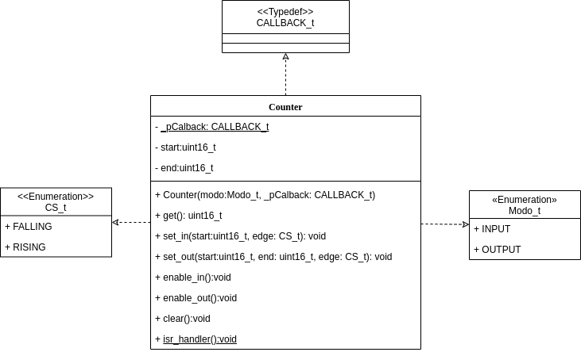

# IFSC - Instituto Federal de Santa Catarina

### Grupo 2: Ameliza e Natalia

#### Projeto de Sistemas Embarcados (STE), onde foi implementado o periférico TCx de 16bits com dois tipos de interrupção: Output Compare e Input Capture.

Pode-se ver abaixo a modelagem gerada:

